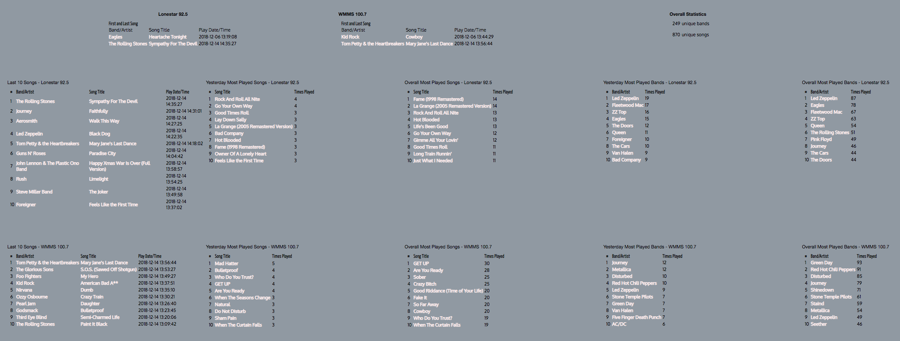

# RadioNerd
My scraping and stats gathering mess of code for iHeart radio.

# Background
Actually, this was a project that started after I convinced myself that my local Classic Rock radio station *(Lonestar 92.5)* 
was playing the same songs over and over. I was complaining to a co-worker, Bobbie Turner, and I discussed ways to track this.
I figured that anything from about 1965 till about 2000 could be 
considered "Classic Rock" and even if you just took the top 40 songs for each year in that range, you'd end up with 1400 songs.
Now, even if you split that number in half and had 700 songs in regular rotation, there'd be no way I was hearing the same stuff
day in and day out right?
So we each set out to both scrape the data, and then push it into a database, we collaborated on ideas, but implemented our own 
solutions. After the initial data was collected, we discussed ways of optimizing, and potential for more custom querying of the data.

***update***
After 6 months of collecting data, it turns out my estimate of 1400 songs was pretty close, as of May 21, 2019, 1347 unique songs have been played since I started collecting the data on Dec, 06, 2018..


# The Lowdown
So, was I right? Is my Classic Rock station playing the same stuff over and over?
Well, the data doesn't lie.
I started scraping this data on November 19, 2018, and as of December 15, 2018 I see that there are:
164 unique bands in the database.
636 unique songs in the database.
and a total of 6217 songs have been played. 

I kind of feel like I was right.

# Disclaimer
This is for me, so there are several hardcoded radio stations in the queries within functions.php
YOU will have to make changes as needed if you use this stuff. I'll eventually make it easier to configure.

*query.php is not yet included in this repo, it needs a complete re-write after changes the DB design.*

# Installing
Okay, so on to the technical stuff..

scraper.sh needs to be edited to include the station URL you want to scrape, also db connection info needs updating.
I run scraper.sh out of cron every 15 minutes. *(also, scraper.sh should be way nicer, and will become a python script soon.)*

So the database design looks like this:
1 DB
1 table for each radio station
2 tables, ArtistData, and SongData collect all songs, and bands regardless how many stations are being scraped.
This gives more options for some interesting queries *(check functions.php)* more are on the way.

DB info:
```
DB name: radio

MariaDB [radio]> desc ArtistData;
+------------+-------------+------+-----+---------+-------+
| Field      | Type        | Null | Key | Default | Extra |
+------------+-------------+------+-----+---------+-------+
| artistid   | int(11)     | NO   | PRI | NULL    |       |
| artistname | varchar(80) | YES  |     | NULL    |       |
+------------+-------------+------+-----+---------+-------+

MariaDB [radio]> desc SongData;
+----------+--------------+------+-----+---------+-------+
| Field    | Type         | Null | Key | Default | Extra |
+----------+--------------+------+-----+---------+-------+
| trackid  | int(11)      | NO   | PRI | NULL    |       |
| songname | varchar(100) | YES  |     | NULL    |       |
+----------+--------------+------+-----+---------+-------+

MariaDB [radio]> desc WMMS;
+----------+----------+------+-----+---------+-------+
| Field    | Type     | Null | Key | Default | Extra |
+----------+----------+------+-----+---------+-------+
| playtime | datetime | NO   | PRI | NULL    |       |
| trackid  | int(11)  | YES  |     | NULL    |       |
| artistid | int(11)  | YES  |     | NULL    |       |
+----------+----------+------+-----+---------+-------+

MariaDB [radio]> desc Lonestar925; (call lthis whatever you like..)
+----------+----------+------+-----+---------+-------+
| Field    | Type     | Null | Key | Default | Extra |
+----------+----------+------+-----+---------+-------+
| playtime | datetime | NO   | PRI | NULL    |       |
| trackid  | int(11)  | YES  |     | NULL    |       |
| artistid | int(11)  | YES  |     | NULL    |       |
+----------+----------+------+-----+---------+-------+
```
